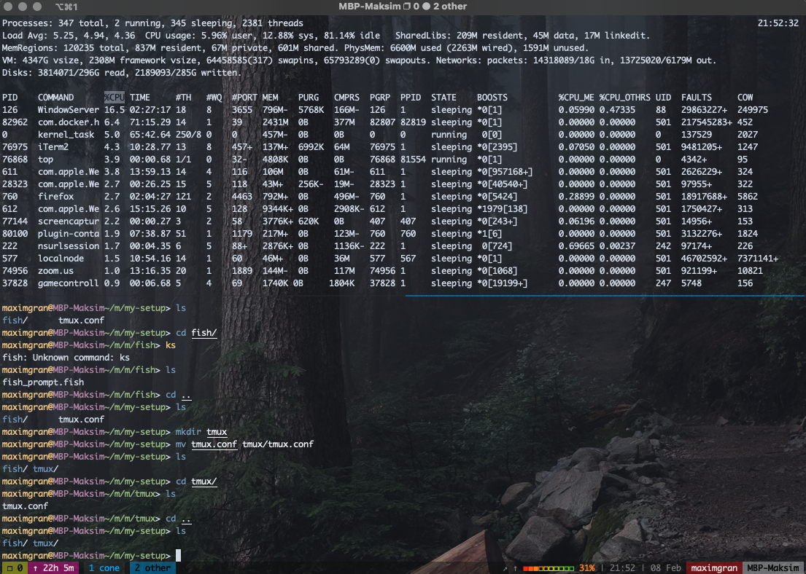
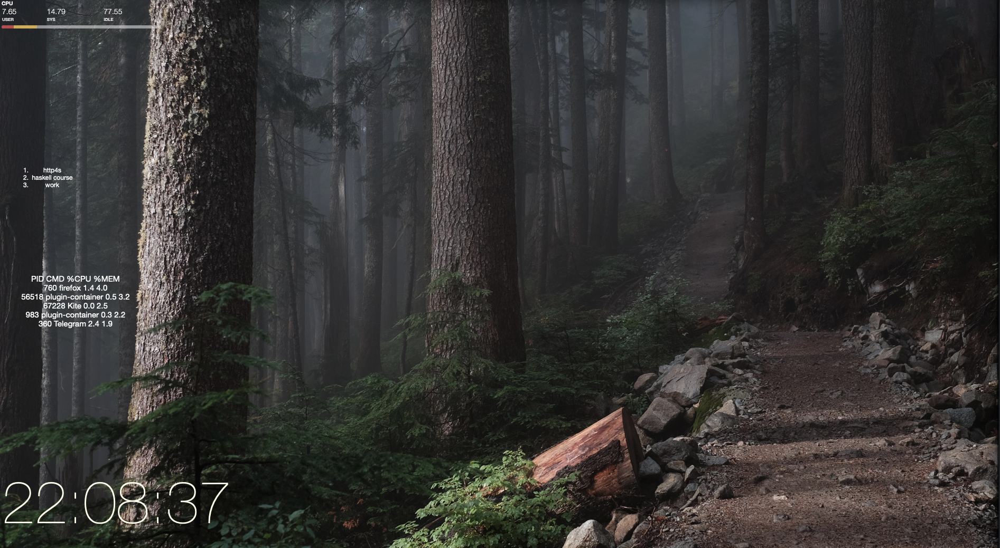
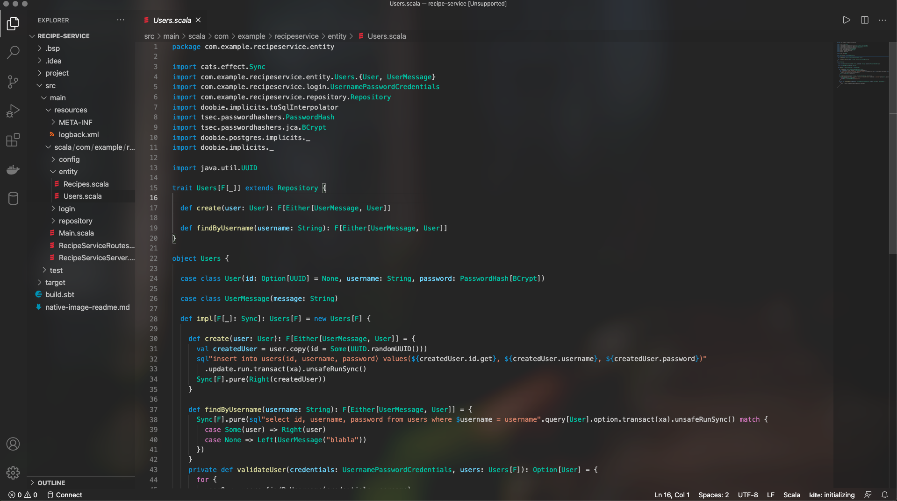
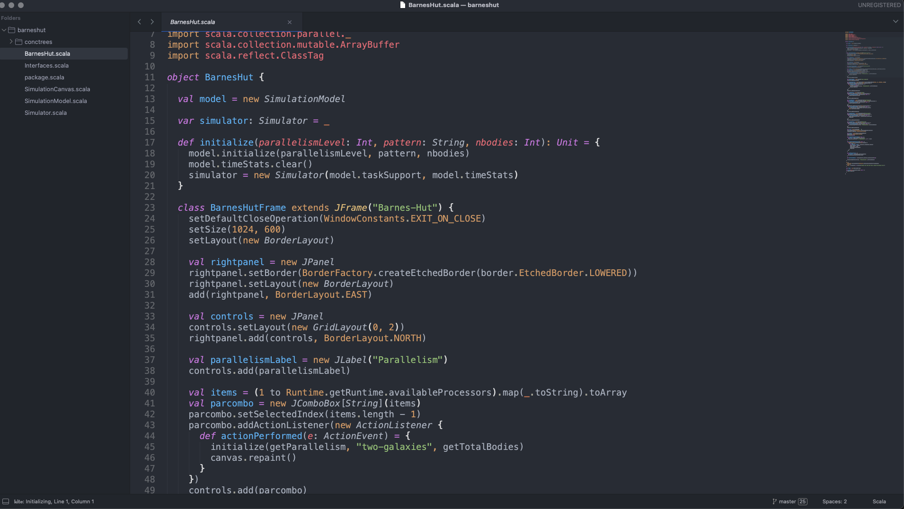
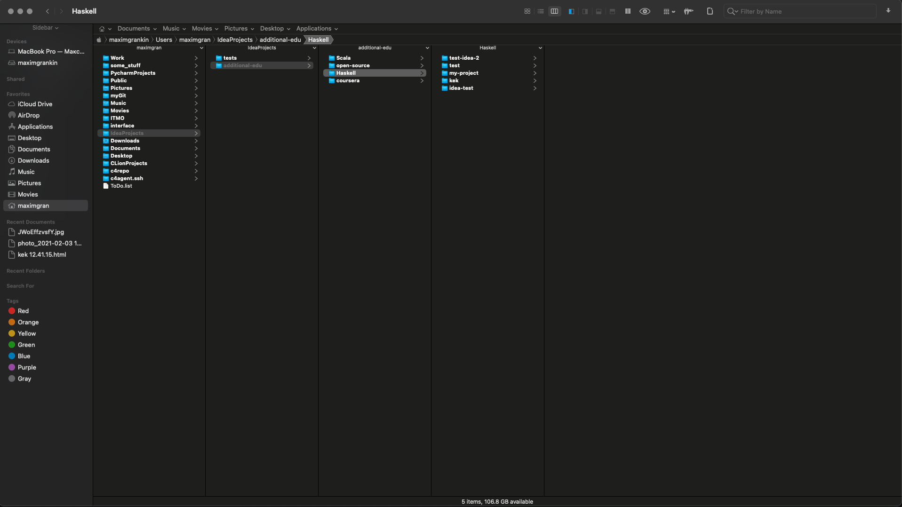
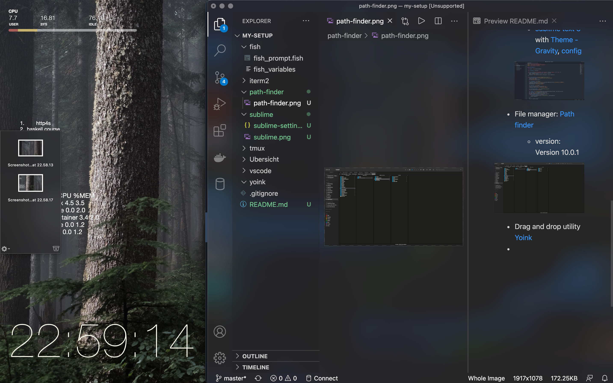
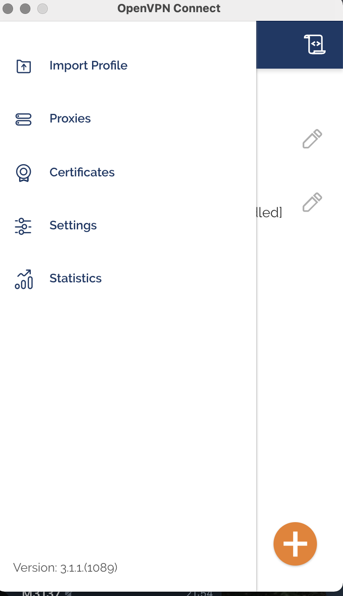

# My macOS setup

Current macOS version: **macOS** Big Sur 11.1

## Main utilities

- Terminal emulator: [iterm2](https://iterm2.com/); [nord config](https://github.com/maxim092001/my-setup/blob/master/iterm2/nord.itermcolors); made transparent for better usability.

- Tmux: [tmux](https://github.com/tmux/tmux/wiki); [config](https://github.com/maxim092001/my-setup/blob/master/tmux/tmux.conf) insipired by [.tmux](https://github.com/gpakosz/.tmux)

- Shell: [fish](https://fishshell.com/)
    - version: 3.1.2
    - [prompt](fish/fish_prompt.fish)
    - [variables](fish/fish_variables)

- Custom widgets for **macOS**: [Übersicht](https://tracesof.net/uebersicht/)
    - [CPU Widget](Ubersicht/widgets/fan-bar.widget/index.coffee)
    - [ToDo List](Ubersicht/widgets/to-do-list/index.coffee)
    - [Top Widget](Ubersicht/widgets/top.widget/index.coffee)
    - [Simple Clock](Ubersicht/widgets/simple-clock.widget/index.coffee)

- Text editors: 
    - [vscode](https://code.visualstudio.com/) with [Vibrancy plugin](https://marketplace.visualstudio.com/items?itemName=eyhn.vscode-vibrancy) for Acrylic effect.
    
    

    - [sublime text 3](https://www.sublimetext.com/3) with [Theme - Gravity](https://packagecontrol.io/packages/Theme%20-%20Gravity), [config](sublime/sublime-settings.json)
    
    

- File manager: [Path finder](https://cocoatech.com/#/)
    - version: Version 10.0.1

- Drag and drop utility [Yoink](https://eternalstorms.at/yoink/mac/)

- Windows manager: [Tiles](https://freemacsoft.net/tiles/)
  
- VPN: Custom VPN located on [Digital Ocean](https://cloud.digitalocean.com/) and OpenVPN Connect client

